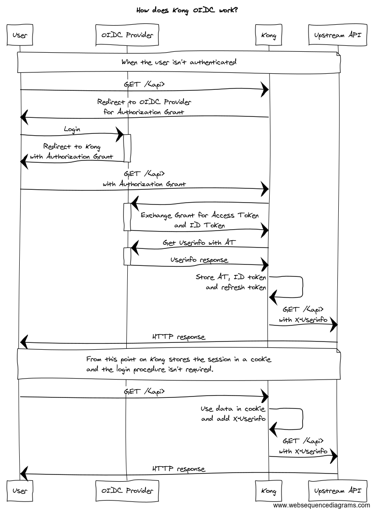

# What is Kong OIDC plugin

[](https://gitter.im/nokia/kong-oidc?utm_source=badge&utm_medium=badge&utm_campaign=pr-badge&utm_content=badge)

**Continuous
Integration:** [](https://travis-ci.org/nokia/kong-oidc)
[](https://coveralls.io/github/nokia/kong-oidc?branch=master) <br/>

**kong-oidc** is a plugin for [Kong](https://github.com/Mashape/kong) implementing the
[OpenID Connect](http://openid.net/specs/openid-connect-core-1_0.html) Relying Party (RP) functionality.

It authenticates users against an OpenID Connect Provider using
[OpenID Connect Discovery](http://openid.net/specs/openid-connect-discovery-1_0.html)
and the Basic Client Profile (i.e. the Authorization Code flow).

It maintains sessions for authenticated users by leveraging `lua-resty-openidc` thus offering a configurable choice
between storing the session state in a client-side browser cookie or use in of the server-side storage
mechanisms `shared-memory|memcache|redis`.

It supports server-wide caching of resolved Discovery documents and validated Access Tokens.

It can be used as a reverse proxy terminating OAuth/OpenID Connect in front of an origin server so that the origin
server/services can be protected with the relevant standards without implementing those on the server itself.

Introspection functionality add capability for already authenticated users and/or applications that already posses acces
token to go through kong. The actual token verification is then done by Resource Server.

## How does it work

The diagram below shows the message exchange between the involved parties.



The `X-Userinfo` header contains the payload from the Userinfo Endpoint

```
X-Userinfo: {"preferred_username":"alice","id":"60f65308-3510-40ca-83f0-e9c0151cc680","sub":"60f65308-3510-40ca-83f0-e9c0151cc680"}
```

The plugin also sets the `ngx.ctx.authenticated_consumer` variable, which can be using in other Kong plugins:

```
ngx.ctx.authenticated_consumer = {
    id = "60f65308-3510-40ca-83f0-e9c0151cc680",   -- sub field from Userinfo
    username = "alice"                             -- preferred_username from Userinfo
}
```

## Dependencies

**kong-oidc** depends on the following package:

- [`lua-resty-openidc`](https://github.com/pingidentity/lua-resty-openidc/)

## Installation

If youre using `luarocks` execute the following:

     luarocks install kong-oidc

You also need to set the `KONG_PLUGINS` environment variable

     export KONG_PLUGINS=oidc

## Usage

### Parameters

| Parameter | Type | Default  | Required | description |
| --- | --- | --- | --- | --- |
| `name` | string | `oidc` | true | plugin name, has to be `oidc` |
| `config.client_id` | string | | true | OIDC Client ID  |
| `config.client_secret` | string | | false | OIDC Client secret |
| `config.discovery` | string | `https://.well-known/openid-configuration` | true | OIDC Discovery Endpoint (`/.well-known/openid-configuration`) |
| `config.scope` | string | `openid` | true | OAuth2 Token scope. To use OIDC it has to contains the `openid` scope |
| `config.introspection_endpoint` | string | | false | Token introspection endpoint given by the OpenID provider |
| `config.timeout` | number | | false | OIDC endpoint calls timeout |
| `config.introspection_endpoint_auth_method` | string | | false |  Token introspection auth method. resty-openidc supports `client_secret_(basic|post)` |
| `config.introspection_expiry_claim` | string | exp | false | |
| `config.introspection_interval` | number | 0 | false | Configures the timeout for token introspection cache |
| `config.introspection_cache_ignore` | boolean | false | false | |
| `config.bearer_only` | string | `no` | true | Only introspect tokens without redirecting |
| `config.realm` | string | `kong` | true | Realm used in WWW-Authenticate response header |
| `config.redirect_uri_path` | string | | true | |
| `config.redirect_uri` | string | | false | |
| `config.response_type`  | string  | true  | "code"  | | 
| `config.ssl_verify`  | string  | true  | "no"  | Enable SSL verification to OIDC Provider | 
| `config.token_endpoint_auth_method`  | string  | true  | "client_secret_post"  | | 
| `config.session_secret`  | string  | false  | "623q4hR325t36VsCD3g567922IC0073T"   | Additional parameter, which is used to encrypt the session cookie. Needs to be random and unique across all Kong instances| 
| `config.recovery_page_path`  | string"  | |
| `config.logout_path`  | string  | false  | /logout  | Absolute path used to logout from the OIDC RP | 
| `config.redirect_after_logout_uri`  | string  | false  | /  | Uri to be redirected after logout process is done | 
| `config.post_logout_redirect_uri`  | string  | false  | |
| `config.redirect_after_logout_with_id_token_hint`  | boolean  | false  | true  |
| `config.filters`  | string  | false |  | Regular expressions to be filtered in Kong requests (Ex: .js, .css)|
| `config.session_name`  | string  | false  | session  | Name of the session cookie |
| `config.session_storage`  | string  | false  | cookie  | |
| `config.session_strategy`  | string  | false  | regenerate | |
| `config.session_redis_host`  | string  | false  | 127.0.0.1  |  |
| `config.session_redis_port`  | string  | false  | 6379  | |
| `config.session_redis_server_name`  | string  | false  | | |
| `config.session_redis_auth`  | string  | false  | |  |
| `config.session_redis_uselocking`  | string  | false  | false  |  |
| `config.session_redis_database`  | string  | false  |  |
| `config.session_redis_prefix`  | string  | false  |  |
| `config.session_redis_ssl`  | string  | false  | true  | Use true if redis connection has enabled encryption |
| `config.session_redis_ssl_verify`  | string  | false  | off |  |
| `config.session_redis_pool_size`  | string  | false  | 10|  |
| `config.session_redis_pool_backlog`  | string  | false  | 10 | |
| `config.session_cookie_samesite`  | string  | false  | None | Change to Strict if you need to enable the cookie only for the service domain |
| `config.session_cookie_secure` | boolean  | false  | true |  |
| `config.session_cookie_domain`  | string  | false  | | |

### Enabling

To enable the plugin only for one API:

```
POST /apis/<api_id>/plugins/ HTTP/1.1
Host: localhost:8001
Content-Type: application/x-www-form-urlencoded
Cache-Control: no-cache

name=oidc&config.client_id=kong-oidc&config.client_secret=29d98bf7-168c-4874-b8e9-9ba5e7382fa0&config.discovery=https%3A%2F%2F<oidc_provider>%2F.well-known%2Fopenid-configuration
```

To enable the plugin globally:

```
POST /plugins HTTP/1.1
Host: localhost:8001
Content-Type: application/x-www-form-urlencoded
Cache-Control: no-cache

name=oidc&config.client_id=kong-oidc&config.client_secret=29d98bf7-168c-4874-b8e9-9ba5e7382fa0&config.discovery=https%3A%2F%2F<oidc_provider>%2F.well-known%2Fopenid-configuration
```

A successful response:

```
HTTP/1.1 201 Created
Date: Tue, 24 Oct 2017 19:37:38 GMT
Content-Type: application/json; charset=utf-8
Transfer-Encoding: chunked
Connection: keep-alive
Access-Control-Allow-Origin: *
Server: kong/0.11.0

{
    "created_at": 1508871239797,
    "config": {
        "response_type": "code",
        "client_id": "kong-oidc",
        "discovery": "https://<oidc_provider>/.well-known/openid-configuration",
        "scope": "openid",
        "ssl_verify": "no",
        "client_secret": "29d98bf7-168c-4874-b8e9-9ba5e7382fa0",
        "token_endpoint_auth_method": "client_secret_post"
     | 
    "id": "58cc119b-e5d0-4908-8929-7d6ed73cb7de",
    "enabled": true,
    "name": "oidc",
    "api_id": "32625081-c712-4c46-b16a-5d6d9081f85f"
}
```

### Upstream API request

The plugin adds a additional `X-Userinfo`, `X-Access-Token` and `X-Id-Token` headers to the upstream request, which can
be consumer by upstream server. All of them are base64 encoded:

```
GET / HTTP/1.1
Host: netcat:9000
Connection: keep-alive
X-Forwarded-For: 172.19.0.1
X-Forwarded-Proto: http
X-Forwarded-Host: localhost
X-Forwarded-Port: 8000
X-Real-IP: 172.19.0.1
Cache-Control: max-age=0
User-Agent: Mozilla/5.0 (Windows NT 10.0; Win64; x64) AppleWebKit/537.36 (KHTML, like Gecko) Chrome/61.0.3163.100 Safari/537.36
Upgrade-Insecure-Requests: 1
Accept: text/html,application/xhtml+xml,application/xml;q=0.9,image/webp,image/apng,*/*;q=0.8
Accept-Encoding: gzip, deflate
Accept-Language: pl-PL,pl;q=0.8,en-US;q=0.6,en;q=0.4
Cookie: session=KOn1am4mhQLKazlCA.....
X-Userinfo: eyJnaXZlbl9uYW1lIjoixITEmMWaw5PFgcW7xbnEhiIsInN1YiI6ImM4NThiYzAxLTBiM2ItNDQzNy1hMGVlLWE1ZTY0ODkwMDE5ZCIsInByZWZlcnJlZF91c2VybmFtZSI6ImFkbWluIiwibmFtZSI6IsSExJjFmsOTxYHFu8W5xIYiLCJ1c2VybmFtZSI6ImFkbWluIiwiaWQiOiJjODU4YmMwMS0wYjNiLTQ0MzctYTBlZS1hNWU2NDg5MDAxOWQifQ==
X-Access-Token: eyJhbGciOiJSUzI1NiIsInR5cCIgOiAiSldUIiwia2lkIiA6ICJGenFSY0N1Ry13dzlrQUJBVng1ZG9sT2ZwTFhBNWZiRGFlVDRiemtnSzZRIn0.eyJqdGkiOiIxYjhmYzlkMC1jMjlmLTQwY2ItYWM4OC1kNzMyY2FkODcxY2IiLCJleHAiOjE1NDg1MTA4MjksIm5iZiI6MCwiaWF0IjoxNTQ4NTEwNzY5LCJpc3MiOiJodHRwOi8vMTkyLjE2OC4wLjk6ODA4MC9hdXRoL3JlYWxtcy9tYXN0ZXIiLCJhdWQiOlsibWFzdGVyLXJlYWxtIiwiYWNjb3VudCJdLCJzdWIiOiJhNmE3OGQ5MS01NDk0LTRjZTMtOTU1NS04NzhhMTg1Y2E0YjkiLCJ0eXAiOiJCZWFyZXIiLCJhenAiOiJrb25nIiwibm9uY2UiOiJmNGRkNDU2YzBjZTY4ZmFmYWJmNGY4ZDA3YjQ0YWE4NiIsImF1dGhfdGltZSI6…IiwibWFuYWdlLWFjY291bnQtbGlua3MiLCJ2aWV3LXByb2ZpbGUiXX19LCJzY29wZSI6Im9wZW5pZCBwcm9maWxlIGVtYWlsIiwiZW1haWxfdmVyaWZpZWQiOmZhbHNlLCJwcmVmZXJyZWRfdXNlcm5hbWUiOiJhZG1pbiJ9.GWuguFjSEDGxw_vbD04UMKxtai15BE2lwBO0YkSzp-NKZ2SxAzl0nyhZxpP0VTzk712nQ8f_If5-mQBf_rqEVnOraDmX5NOXP0B8AoaS1jsdq4EomrhZGqlWmuaV71Cnqrw66iaouBR_6Q0s8bgc1FpCPyACM4VWs57CBdTrAZ2iv8dau5ODkbEvSgIgoLgBbUvjRKz1H0KyeBcXlVSgHJ_2zB9q2HvidBsQEIwTP8sWc6er-5AltLbV8ceBg5OaZ4xHoramMoz2xW-ttjIujS382QQn3iekNByb62O2cssTP3UYC747ehXReCrNZmDA6ecdnv8vOfIem3xNEnEmQw
X-Id-Token: eyJuYmYiOjAsImF6cCI6ImtvbmciLCJpYXQiOjE1NDg1MTA3NjksImlzcyI6Imh0dHA6XC9cLzE5Mi4xNjguMC45OjgwODBcL2F1dGhcL3JlYWxtc1wvbWFzdGVyIiwiYXVkIjoia29uZyIsIm5vbmNlIjoiZjRkZDQ1NmMwY2U2OGZhZmFiZjRmOGQwN2I0NGFhODYiLCJwcmVmZXJyZWRfdXNlcm5hbWUiOiJhZG1pbiIsImF1dGhfdGltZSI6MTU0ODUxMDY5NywiYWNyIjoiMSIsInNlc3Npb25fc3RhdGUiOiJiNDZmODU2Ny0zODA3LTQ0YmMtYmU1Mi1iMTNiNWQzODI5MTQiLCJleHAiOjE1NDg1MTA4MjksImVtYWlsX3ZlcmlmaWVkIjpmYWxzZSwianRpIjoiMjI1ZDRhNDItM2Y3ZC00Y2I2LTkxMmMtOGNkYzM0Y2JiNTk2Iiwic3ViIjoiYTZhNzhkOTEtNTQ5NC00Y2UzLTk1NTUtODc4YTE4NWNhNGI5IiwidHlwIjoiSUQifQ==
```

## Development

### Running Unit Tests

To run unit tests, run the following command:

```
./bin/run-unit-tests.sh
```

This may take a while for the first run, as the docker image will need to be built, but subsequent runs will be quick.

### Building the Integration Test Environment

To build the integration environment (Kong with the oidc plugin enabled, and Keycloak as the OIDC Provider), you will
first need to find your computers IP, and assign that to the environment variable `IP`. Finally, you will run
the `./bin/build-env.sh` command. Heres an example:

```
export IP=192.168.0.1
./bin/build-env.sh
```

To tear the environment down:

```
./bin/teardown-env.sh
```
